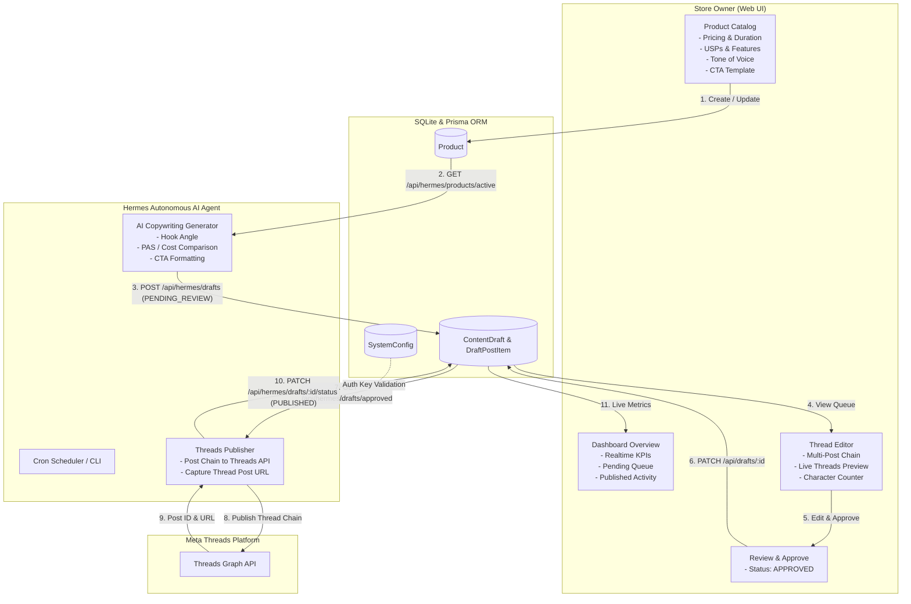

# 🧵 Threads Marketing Engine

> **Intelligent Content Automation & Digital Product Marketing Engine with Human-in-the-Loop Review & Hermes AI Agent Integration.**

Threads Marketing Engine is a high-performance marketing pipeline designed for digital product businesses (subscription services, SaaS licenses, software accounts, and digital tools). It automates high-converting copywriting on Meta's Threads platform while keeping the store owner in full control through an intuitive human-in-the-loop review and approval workflow.

---

## 📑 Table of Contents

- [Architecture & Workflow](#-architecture--workflow)
- [Dual-Environment & Branching Protocol](#-dual-environment--branching-protocol)
- [Key Features](#-key-features)
- [Tech Stack](#-tech-stack)
- [Quick Start](#-quick-start)
- [Hermes Agent Integration](#-hermes-agent-integration)
  - [Runner Scripts (TS & Python)](#runner-scripts-typescript--python)
  - [Automated Crontab Scheduling](#automated-crontab-scheduling)
  - [Hermes Copywriting Framework](#hermes-copywriting-frameworks)
- [REST API Reference](#-rest-api-reference)
  - [Store Owner & Management APIs](#1-store-owner--management-apis)
  - [Hermes Autonomous Agent APIs](#2-hermes-autonomous-agent-apis)
- [Testing & Quality Assurance](#-testing--quality-assurance)
- [License](#-license)

---

## 🏗 Architecture & Workflow



---

## 🛡️ Dual-Environment & Branching Protocol

To ensure 100% stability, zero downtime, and complete isolation between live traffic and feature development, the codebase is partitioned into two distinct directories and branches under GitHub repository `git@github.com:HanifMukkorrobin/threads-marketing.git`:

| Environment | Directory Path | Git Branch | Database | Port | Description & Scope |
| :--- | :--- | :--- | :--- | :--- | :--- |
| **🛠️ Development** | `/home/ubuntu/project/threads-marketing` | `dev` | `prisma/dev.db` | `3000` | **Active workspace for all coding, experimentation, bug fixes, and Vitest test suite.** |
| **🚀 Production** | `/home/ubuntu/production/threads-marketing` | `main` | `prisma/prod.db` | `4000` | **Live public server (`https://threads.hadestech.web.id`) served by PM2 cluster & Hermes Cron.** |

### 🔄 Deployment Workflow:
1. **Work in Dev**: Make edits, write tests, and verify in `/home/ubuntu/project/threads-marketing` (`npm test`).
2. **Push Dev**: `git push origin dev`
3. **Merge to Main**: Merge `dev` into `main` branch via GitHub PR or CLI.
4. **Deploy in Prod**: In `/home/ubuntu/production/threads-marketing`:
   ```bash
   git pull origin main
   npm run build
   npm run pm2:restart
   ```

---

## ✨ Key Features

### 🛍️ Digital Product Catalog
- Structured digital variant management (price, duration, license type).
- Unique Selling Propositions (USPs), target audience profiles, tone-of-voice settings, and custom Call-to-Action (CTA) templates.
- Active/Inactive toggling to dynamically feed or pause autonomous content generation.

### ✍️ Interactive Thread Editor & Simulator
- **Live Threads Preview**: Real-time rendering mirroring the exact aesthetics and typography of the Meta Threads mobile/web app.
- **Multi-Post Chain Manager**: Add, reorder, delete, and manage interconnected thread posts.
- **Character Counter & Limit Warning**: Strict 500-character constraint monitoring per post with visual progress indicators.
- **Hook Angle Presets**: Built-in copywriting hooks including *Problem-Agitate-Solve (PAS)*, *Cost Comparison*, *Secret Lifehacks*, and *Social Proof*.

### 🛡️ Human-in-the-Loop Review Pipeline
- AI generates drafts with status `PENDING_REVIEW`.
- Store owner reviews, refines wording, attaches media URLs, and approves (`APPROVED`) or discards drafts.
- Hermes publisher strictly only posts approved content, preventing hallucinated or unwanted posts from going live.

### 📊 Executive Overview Dashboard
- High-level metric cards for quick business visibility (Total Products, Active Catalog, Pending Reviews, Approved Queue, Published Posts, Failed Items).
- Actionable review list with 1-click navigation to edit and approve.
- Real-time published feeds with direct links to live Threads posts.
- Hermes agent connection status indicator.

### 🔐 Hermes Security & Settings
- Secure REST API with `Authorization: Bearer <API_KEY>` or `x-api-key: <API_KEY>`.
- One-click API Key regeneration and rotation via Settings interface.
- Store branding customization (Store Name, Handle/Username, Avatar).

---

## 💻 Tech Stack

- **Framework**: [Next.js 14](https://nextjs.org/) (App Router, Server Components & Route Handlers)
- **Language**: [TypeScript](https://www.typescriptlang.org/) (Strict Mode)
- **Database & ORM**: [SQLite](https://www.sqlite.org/) with [Prisma ORM](https://www.prisma.io/)
- **Styling**: [Tailwind CSS](https://tailwindcss.com/) with custom design system
- **Icons**: [Lucide React](https://lucide.dev/)
- **Testing**: [Vitest](https://vitest.dev/) with Node NextRequest simulation
- **Runner**: TypeScript (`tsx`) & Zero-dependency Python 3

---

## 🚀 Quick Start

### 1. Prerequisites
- **Node.js**: v18.0.0 or higher
- **npm**: v9.0.0 or higher

### 2. Installation & Setup

```bash
# Clone the repository
git clone https://github.com/your-username/threads-marketing.git
cd threads-marketing

# Install dependencies
npm install

# Initialize SQLite database schema
npx prisma db push

# Seed initial digital product catalog & system configurations
npx prisma db seed
```

### 3. Run Development Server

```bash
npm run dev
```

Open [http://localhost:3000](http://localhost:3000) in your browser.

---

## 🤖 Hermes Agent Integration

The **Hermes Agent** is an autonomous worker that interacts with Threads Marketing Engine via REST API endpoints.

### Runner Scripts (TypeScript & Python)

The repository provides production-ready runner scripts in `scripts/hermes-runner/`:

```
scripts/hermes-runner/
├── hermes_mock_cron.ts    # TypeScript runner (executed with npx tsx)
├── hermes_mock_cron.py    # Python 3 runner (Zero external dependencies)
└── README.md              # Detailed runner documentation
```

#### TypeScript Execution:
```bash
# Run complete cycle (Generate AI Drafts + Publish Approved Drafts)
npx tsx scripts/hermes-runner/hermes_mock_cron.ts --action=all

# Only generate new content drafts for active products
npx tsx scripts/hermes-runner/hermes_mock_cron.ts --action=generate

# Only publish approved drafts
npx tsx scripts/hermes-runner/hermes_mock_cron.ts --action=post

# Custom endpoint and API key
npx tsx scripts/hermes-runner/hermes_mock_cron.ts --base-url=http://localhost:3000 --api-key=hermes-secret-key-2026 --action=all
```

#### Python 3 Execution:
```bash
# Make executable
chmod +x scripts/hermes-runner/hermes_mock_cron.py

# Run complete cycle
python3 scripts/hermes-runner/hermes_mock_cron.py --action all
```

---

### Hermes CLI & Gateway Cron Scheduling (`hermes cron`)

The runner integrates natively with the **Hermes Gateway Service** (`hermes cron`):

```bash
# Check Hermes cron scheduler status
hermes cron status

# List active scheduled jobs
hermes cron list
```

#### Active Hermes Scheduled Jobs:
1. **`threads-marketing-post`** (`every 1m`): Fetches `APPROVED` drafts and publishes them to Threads.
2. **`threads-marketing-generate`** (`every 120m`): Generates new product promos and organic threads to `PENDING_REVIEW`.
3. **`threads-token-refresh`** (`every 21600m`): Automatically refreshes long-lived Meta Threads access tokens.

---

### Hermes Copywriting Framework (`/ecommerce-copy-humanizer-id`)

When generating threads, Hermes adheres strictly to the Indonesian e-commerce copywriting standard:

1. **🎭 Storytelling & Curhat Relate**: Relatable daily friction (e.g. ad interruptions, account limits) solved by affordable subscriptions.
2. **💡 Solusi Cerdas & Anti-Boncos**: Price-to-value comparisons with warranty highlights and savings calculation.
3. **⚡️ Productivity & Feature Hack**: Workflow enhancement tips showcasing premium capabilities in action.
4. **🔥 FOMO & Slot Terbatas**: Scarcity-driven urgency for flash deals and limited activation slots.
5. **🌱 Organic & Non-Product Content (`productId: null`)**: High-value tips, tech insights, and AI prompting formulas that drive bookmarks, shares, and brand authority.

---

### ✨ Interactive AI Copilot Revision Engine

Store owners can interactively refine drafts directly within the web editor:
- **Targeted Part Revision**: Instruction like `"ubah post 3 jadi ajak DM admin"` selectively updates only post 3.
- **Tone & Style Shifts**: Prompt `"bikin gaya FOMO kuota terbatas"` or `"buat lebih santai"` reformulates the entire thread chain.
- **Dynamic Store Customization**: Automatically injects your configured store name and handle (e.g. `@hades.zshrc`) into all generated CTAs and bio references.

---

## 📡 REST API Reference

All requests accept and return standard `application/json`.

---

### 1. Store Owner & Management APIs

#### `GET /api/overview`
Retrieves dashboard summary statistics and recent activity queues.
- **Response `200 OK`**:
```json
{
  "success": true,
  "counts": {
    "totalProducts": 12,
    "activeProducts": 10,
    "pendingDrafts": 3,
    "approvedDrafts": 2,
    "scheduledDrafts": 1,
    "publishedDrafts": 45,
    "failedDrafts": 0,
    "totalDrafts": 51
  },
  "recentPendingDrafts": [...],
  "recentPublishedDrafts": [...],
  "hermesStatus": {
    "isConfigured": true,
    "hasApiKey": true,
    "apiKeyPreview": "hermes_...2026"
  }
}
```

---

#### `GET /api/products`
Retrieves all digital products with optional category and search filters.
- **Query Parameters**: `category` (optional), `search` (optional)

#### `POST /api/products`
Creates a new digital product catalog entry.
- **Request Body**:
```json
{
  "name": "Canva Pro 1 Tahun",
  "category": "Design Tools",
  "description": "Upgrade akun pribadi legal invite",
  "variants": [
    { "name": "1 Tahun Akun Pribadi", "price": 45000, "duration": "365 hari" }
  ],
  "usp": ["Garansi 1 Tahun", "No Reset", "Invite Legal"],
  "targetAudience": "Desainer & Mahasiswa",
  "toneOfVoice": "Solutif & Ramah",
  "ctaTemplate": "Ketik 'CANVA' untuk klaim promo!",
  "isActive": true
}
```

---

#### `GET /api/drafts`
Retrieves content drafts filtered by status (`status=PENDING_REVIEW|APPROVED|PUBLISHED|ALL`), product, or search terms.

#### `GET /api/drafts/:id`
Retrieves full details of a draft including its ordered post chain items and linked product.

#### `PUT /api/drafts/:id`
Updates draft metadata and replaces its post items.
- **Request Body**:
```json
{
  "title": "Updated Title",
  "hookAngle": "Cost Comparison",
  "posts": [
    { "orderIndex": 0, "content": "Post 1 text", "mediaUrl": null },
    { "orderIndex": 1, "content": "Post 2 text", "mediaUrl": "https://example.com/image.png" }
  ]
}
```

#### `PATCH /api/drafts/:id`
Updates draft status (`status: "APPROVED" | "PENDING_REVIEW" | "SCHEDULED" | "PUBLISHED" | "FAILED"`).

#### `DELETE /api/drafts/:id`
Deletes a draft and cascades deletion to all associated post chain items.

---

#### `GET /api/settings`
Retrieves system settings (`STORE_NAME`, `STORE_USERNAME`, `HERMES_API_KEY`, etc.).

#### `PUT /api/settings`
Updates system settings key-value pairs.

#### `POST /api/settings`
Executes settings actions (e.g. `{"action": "regenerate-key"}`).

---

### 2. Hermes Autonomous Agent APIs

> 🔒 **Authentication Required**: All `/api/hermes/*` endpoints require authentication. Include `Authorization: Bearer <HERMES_API_KEY>` or `x-api-key: <HERMES_API_KEY>` header with each request.

---

#### `GET /api/hermes/products/active`
Returns all active digital products with structured variants, USPs, and copywriting prompts.
- **Headers**: `Authorization: Bearer <HERMES_API_KEY>`
- **Response `200 OK`**:
```json
{
  "success": true,
  "count": 1,
  "products": [
    {
      "id": "cm01productid123",
      "name": "Canva Pro 1 Tahun",
      "slug": "canva-pro-1-tahun",
      "category": "Design Tools",
      "description": "Upgrade akun pribadi legal",
      "variants": [{ "name": "1 Tahun", "price": 45000, "duration": "365 hari" }],
      "usp": ["Garansi 1 Tahun", "Invite Legal"],
      "targetAudience": "Desainer & Mahasiswa",
      "toneOfVoice": "Solutif & Ramah",
      "ctaTemplate": "Ketik CANVA untuk promo!",
      "isActive": true
    }
  ]
}
```

---

#### `POST /api/hermes/drafts`
Receives AI-generated draft threads and stores them with `PENDING_REVIEW` status.
- **Headers**: `Authorization: Bearer <HERMES_API_KEY>`
- **Request Body**:
```json
{
  "title": "Trik Hemat Canva Pro 1 Tahun Modal 45rb 🎨",
  "productId": "cm01productid123",
  "type": "THREAD_CHAIN",
  "hookAngle": "Cost Comparison",
  "posts": [
    { "orderIndex": 0, "content": "Masih bayar Canva Pro mahal per bulan? Simak trik ini 🧵👇" },
    { "orderIndex": 1, "content": "Dapatkan Canva Pro 1 tahun legal invite cuma 45rb dengan full garansi 365 hari!" },
    { "orderIndex": 2, "content": "👉 Klik link di bio untuk aktivasi instan!" }
  ],
  "metadata": {
    "framework": "PAS",
    "promptTokens": 350,
    "completionTokens": 180
  }
}
```
- **Response `201 Created`**:
```json
{
  "success": true,
  "draft": {
    "id": "cm01draftid456",
    "status": "PENDING_REVIEW",
    "source": "HERMES_AI",
    "posts": [...]
  }
}
```

---

#### `GET /api/hermes/drafts/approved`
Fetches drafts approved by human review ready for publication.
- **Headers**: `Authorization: Bearer <HERMES_API_KEY>`
- **Response `200 OK`**:
```json
{
  "success": true,
  "count": 1,
  "drafts": [
    {
      "id": "cm01draftid456",
      "title": "Trik Hemat Canva Pro 1 Tahun Modal 45rb 🎨",
      "status": "APPROVED",
      "type": "THREAD_CHAIN",
      "posts": [
        { "id": "post-0", "orderIndex": 0, "content": "..." },
        { "id": "post-1", "orderIndex": 1, "content": "..." }
      ],
      "product": { ... }
    }
  ]
}
```

---

#### `PATCH /api/hermes/drafts/:id/status`
Updates publication outcome (success or error).
- **Headers**: `Authorization: Bearer <HERMES_API_KEY>`
- **Success Request Body**:
```json
{
  "status": "PUBLISHED",
  "threadPostId": "180293849182390",
  "threadPostUrl": "https://threads.net/@tokodigital.id/post/C9xyz123",
  "publishedAt": "2026-08-16T06:00:00.000Z"
}
```
- **Failure Request Body**:
```json
{
  "status": "FAILED",
  "errorMessage": "Rate limit exceeded (Code 429)"
}
```

---

## 🧪 Testing & Quality Assurance

The codebase includes an extensive Vitest suite covering unit tests, API integration tests, and full end-to-end user & agent workflows.

```bash
# Run complete test suite
npx vitest run

# Run with test coverage
npx vitest run --coverage

# Run specific test suites
npx vitest run tests/e2e-workflow.test.ts
npx vitest run tests/hermes-api.test.ts
npx vitest run tests/drafts-api.test.ts
npx vitest run tests/products-api.test.ts
```

### Production Build Validation

```bash
npm run build
```

---

## 📄 License

MIT License © 2026 Threads Marketing Engine.
