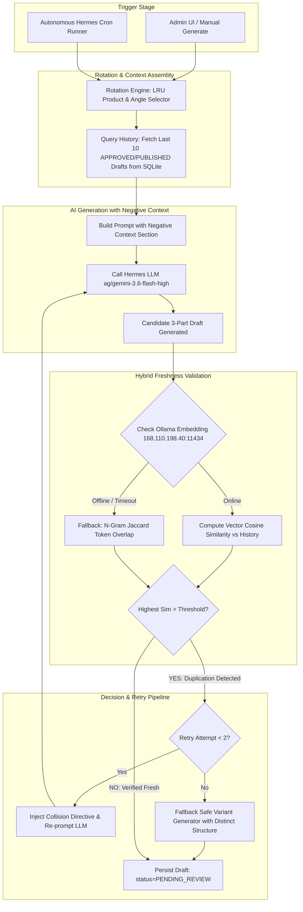

# Phase 1: Hybrid Content Deduplication & Freshness Engine Specification

**Document ID**: `SPEC-2026-08-18-DEDUP-001`  
**Phase**: Phase 1 (Core Guardrail & Anti-Repetition Pipeline)  
**Date**: 2026-08-18  
**Status**: VALIDATED — READY FOR REVIEW  
**Target Platform**: Next.js 14 App Router, TypeScript, SQLite (Prisma ORM), Ollama Embedding (`nomic-embed-text-v2-moe`), Hermes AI Agent (`ag/gemini-3.6-flash-high`)

---

## 1. Executive Summary & Problem Statement

### 1.1 Current Architecture State
1. **Posting Guarantee (Active & Secured)**:  
   Published drafts are strictly locked. When a draft is posted to Meta Threads Graph API, its status is updated to `PUBLISHED` with `publishedAt`, `threadPostId`, and `threadPostUrl`. Endpoint `/api/hermes/drafts/approved` exclusively queries `where: { status: 'APPROVED' }`. Once published, drafts are never posted again.
2. **Generation Repetition Vulnerability (Current Gap)**:  
   Content generation was previously *stateless*. When Hermes AI generated drafts (via UI or background cron), it did not pass historical draft context to the LLM or check whether the generated hook/copy resembled recently published threads for that product.

### 1.2 Objective
Implement an end-to-end **Hybrid Content Deduplication & Freshness Engine** that ensures all generated content is fresh, non-repetitive, and distinct from any previously published or approved content within a rolling 30-day window (or last 10 posts).

---

## 2. System Architecture & End-to-End Flow



---

## 3. Detailed Component Breakdown

### 3.1 `src/lib/embedding-client.ts`
Client for communicating with the Ollama embedding service on VPS (`http://168.110.198.40:11434`).

* **Environment Variables**:
  - `OLLAMA_EMBED_BASE_URL`: Defaults to `http://168.110.198.40:11434`
  - `OLLAMA_EMBED_MODEL`: Defaults to `nomic-embed-text-v2-moe`
  - `OLLAMA_EMBED_TIMEOUT_MS`: `4000ms` (fail-fast to fallback)
* **Core Functions**:
  - `getBatchEmbeddings(texts: string[]): Promise<number[][] | null>`:
    Sends a single batch POST request to `/api/embed` with `{"model": "nomic-embed-text-v2-moe", "input": texts}`. Returns array of vector arrays, or `null` if unreachable/timeout.
  - `cosineSimilarity(vecA: number[], vecB: number[]): number`:
    Pure TypeScript calculation: $\frac{\vec{A} \cdot \vec{B}}{\|\vec{A}\| \|\vec{B}\|}$. Execution time: $< 0.05\text{ ms}$ for 768-dimension vectors.

### 3.2 `src/lib/content-deduplication.ts`
Orchestrator for history lookback, lexical token analysis, and hybrid freshness validation.

* **History Lookback Queries**:
  - `getRecentDraftHistory(productId?: string | null, limit = 10)`:
    - Product Drafts: queries `ContentDraft` where `productId = productId` and `status IN ('APPROVED', 'PUBLISHED')` ordered by `createdAt DESC` limit `10`.
    - Organic Drafts: queries `ContentDraft` where `productId IS NULL` and `status IN ('APPROVED', 'PUBLISHED')` limit `10`.
* **Lexical Fallback (N-gram Jaccard Similarity)**:
  - Text normalization: strip markdown symbols, URLs, emoji, convert to lowercase, remove common Indonesian stopwords.
  - Computes 2-gram and 3-gram sets and calculates Jaccard Index: $\frac{|A \cap B|}{|A \cup B|}$.
* **Hybrid Freshness Check**:
  - `validateDraftFreshness(candidate: GenerationResult, history: HistoricalDraft[])`:
    - Evaluates post 1 (Hook) and full thread chain text against each historical item.
    - Uses Vector Cosine Similarity if embedding service is reachable (Threshold: `0.70`).
    - Uses Lexical Jaccard Overlap if embedding is unreachable (Threshold: `0.60`).
    - Returns `{ isFresh: boolean, score: number, method: 'vector' | 'lexical', matchedSnippet?: string, reason?: string }`.

### 3.3 `src/lib/generation-engine.ts` (Modifications)
Enhances `buildGenerationPrompt` and `generateDraftWithHermes` with negative context and retry loop.

* **Negative Context Injection**:
  If history exists, injects an explicit negative constraints section into the prompt:
  ```
  HINDARI FORMULA, HOOK, DAN ANALOGI BERIKUT (SUDAH PERNAH DITERBITKAN):
  1. "Hook 1..."
  2. "Hook 2..."
  Wajib buat sudut pandang, analogi, dan gaya pembuka yang sama sekali baru dan tidak mengulang kalimat di atas!
  ```
* **Auto-Retry Loop**:
  - Candidate draft is validated via `validateDraftFreshness`.
  - If `isFresh === false` and `attempt < 2`: automatically re-prompts the LLM with explicit feedback:
    *"Draft sebelumnya terlalu mirip dengan hook terdahulu ('[matchedSnippet]'). Buat konsep dan pembuka yang 100% berbeda."*
  - If retry count exhausted: uses distinct structured fallback to ensure draft availability.

### 3.4 `src/lib/rotation-engine.ts`
Intelligent scheduling & selection helper for products and angles.

* **Product LRU Selector**:
  - Calculates staleness score for each active product:
    `score = now - lastDraftCreatedAt (or Infinity if never drafted)`.
  - Returns the product that has gone the longest without content.
* **Angle Rotation**:
  - Queries the last 3 `hookAngle` values used for the target product.
  - Filters out recently used angles from the selection pool, forcing varied angles (e.g. alternating between *Micro-Story*, *Price Breakdown*, *Contrarian*, *Productivity Hack*).

---

## 4. Key Parameters & Thresholds

| Parameter | Value | Rationale |
|---|---|---|
| **Lookback History Limit** | `10 drafts` | Balances sufficient historical memory with LLM context efficiency. |
| **Lookback Time Window** | `30 days` | Content older than 30 days can have refreshed angles with new creative twists. |
| **Vector Cosine Similarity Threshold** | `0.70` | Embeddings from `nomic-embed-text-v2-moe` score ~0.75+ for semantically identical hooks and <0.60 for distinct angles. |
| **Lexical Jaccard Threshold** | `0.60` | Prevents direct phrasing / template duplication in fallback mode. |
| **Max Auto-Retry Attempts** | `2x` | Balances uniqueness guarantee with generation response time. |
| **Embedding Request Timeout** | `4000ms` | Prevents blocking UI/cron if Ollama service is under heavy load. |

---

## 5. Verification & Testing Plan

### 5.1 Unit & Integration Tests (`vitest`)
1. **`embedding-client.test.ts`**:
   - Verify `cosineSimilarity` mathematical precision (orthogonal vectors = 0, identical = 1.0, opposite = -1.0).
   - Mock HTTP failure to verify timeout handling and null return.
2. **`content-deduplication.test.ts`**:
   - Verify lexical normalization and N-gram Jaccard score computation.
   - Test `validateDraftFreshness` with identical, semantically close, and distinct text pairs.
3. **`rotation-engine.test.ts`**:
   - Test LRU product selection with varying draft creation dates.
   - Test angle rotation avoiding last 3 used angles.
4. **`generation-engine.test.ts`**:
   - Verify negative context string generation in `buildGenerationPrompt`.
   - Verify retry mechanism triggers when freshness validator reports collision.

---

## 6. Deployment & Compatibility
- **Database**: 100% backwards-compatible with existing schema (`prisma/schema.prisma`). No database migrations required.
- **Environment Isolation**: Works in local dev (`http://localhost:3000`), Vitest test suite (`test.db`), and production (`https://threads.hadestech.web.id`).
- **Required `.env` Keys**:
  ```env
  OLLAMA_EMBED_BASE_URL="http://168.110.198.40:11434"
  OLLAMA_EMBED_MODEL="nomic-embed-text-v2-moe"
  ```
