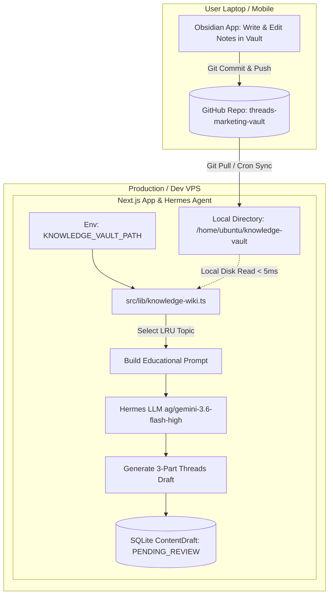

# Phase 2: Standalone Obsidian Markdown Knowledge Vault Integration Specification

**Document ID**: `SPEC-2026-08-18-WIKI-001`  
**Phase**: Phase 2 (Educational Content Sourcing & Multi-Repo Obsidian Vault)  
**Date**: 2026-08-18  
**Status**: DRAFT — READY FOR REVIEW  
**Target Platform**: Next.js 14 App Router, TypeScript, Multi-Repo Git Architecture, Obsidian Markdown Vault, Hermes AI Agent (`ag/gemini-3.6-flash-high`)

---

## 1. Executive Summary & Vision

### 1.1 Motivation
Currently, non-product organic / educational threads rely on generic fallback archetypes. To scale high-authority educational content sustainably, we introduce a **Markdown Knowledge Vault** where deep research notes, frameworks, tool breakdowns, and industry insights are organized in **Obsidian**.

### 1.2 Multi-Repo Isolation Strategy
To prevent git merge conflicts, dirty working trees, and bloat in the main Next.js codebase, the Obsidian Vault is housed in a **dedicated, separate GitHub repository** (e.g. `threads-marketing-vault`):
* **Local Workflow**: The user clones the Vault repository onto their laptop and edits notes seamlessly using Obsidian (with graph views, tags, wikilinks, and templates).
* **Server Workflow**: The server clones the Vault repository into an isolated directory (e.g. `/home/ubuntu/knowledge-vault`) and accesses it via a configurable path environment variable (`KNOWLEDGE_VAULT_PATH`).
* **Clean Boundaries**: Main app code commits (`feat:`, `fix:`) remain 100% isolated from daily marketing research notes.

---

## 2. Multi-Repo Architecture & Integration Flow



---

## 3. Obsidian Markdown Standard & Frontmatter Schema

### 3.1 Vault Organization
Notes can be placed at the root or in organized subfolders inside the Vault:
```
threads-marketing-vault/
├── ai-tools/
│   ├── 2026-top-ai-coding-assistants.md
│   └── prompt-engineering-framework.md
├── productivity/
│   ├── deep-work-90-20-rule.md
│   └── essential-freelance-tools.md
└── security/
    └── official-vs-mod-account-safety.md
```

### 3.2 Frontmatter Schema (YAML)
Every note intended for Hermes content sourcing MUST include standard YAML frontmatter:

```markdown
---
id: "prompt-engineering-framework"
title: "Formula 4 Langkah Prompting AI untuk Mahasiswa & Freelancer"
category: "AI & Tech"
tags: ["ai", "prompting", "productivity", "mahasiswa"]
targetAudience: "Mahasiswa & Profesional Muda"
summary: "Cara membuat prompt AI yang menghasilkan output presisi tanpa gaya bahasa robotik."
priority: "HIGH" # "HIGH" | "NORMAL" | "LOW"
sourceUrl: "https://example.com/research-notes"
isActive: true
---

# Ringkasan Materi & Fakta Utama:
- Problem: Banyak orang pakai AI cuma ketik 'buatkan artikel', hasilnya generik dan kaku.
- Solusi: Formula Role + Context + Constraint + Few-Shot Example.

## Poin Inti untuk Thread:
1. **Role**: Tetapkan persona ahli secara spesifik.
2. **Context**: Jelaskan siapa target pembaca dan situasinya.
3. **Constraint**: Larang kata klise seperti 'di era modern ini'.
4. **Example**: Kasih 1 contoh struktur output yang diinginkan.

## Ajakan Diskusi / CTA Organik:
- Tanya audiens: "Prompt apa yang paling sering kalian pakai sehari-hari?"
- Ajak follow @store_username untuk tips workflow digital lainnya.
```

---

## 4. Component Architecture & Modules

### 4.1 `src/lib/knowledge-wiki.ts`
* **Configuration**:
  - `KNOWLEDGE_VAULT_PATH`: Configured in `.env` (defaults to `./knowledge` if not set).
* **Functions**:
  - `getKnowledgeVaultPath(): string`: Resolves absolute path to the active vault.
  - `loadAllKnowledgeTopics(): Promise<KnowledgeTopic[]>`:
    Scans vault directory recursively, reads `.md` files, parses frontmatter using `gray-matter`. Ignores `.git` and `.obsidian` configuration folders.
  - `getKnowledgeTopicById(id: string): Promise<KnowledgeTopic | null>`:
    Retrieves a specific topic by its slug ID.
  - `selectLRUKnowledgeTopic(topics: KnowledgeTopic[], recentDrafts: ContentDraft[]): KnowledgeTopic`:
    Cross-references topic IDs with the `metadata.sourceTopicId` of recent drafts in SQLite to pick the least-recently used educational topic.

### 4.2 Prompt Synthesis in `src/lib/generation-engine.ts`
When an educational topic is selected for generation:
1. `GenerationInput` receives `knowledgeTopic: KnowledgeTopic`.
2. `buildGenerationPrompt` injects the topic's title, category, summary, target audience, and key insight points into the context.
3. Hermes LLM synthesizes the research note into a humanized, engaging 3-part Thread with thread hook indicator (`🧵👇`), value points, and soft community CTA.

### 4.3 Draft Record Metadata
The created draft is saved to SQLite with:
* `ContentDraft.productId`: `null` (marks it as organic/educational)
* `ContentDraft.source`: `'HERMES_AI'`
* `ContentDraft.hookAngle`: Topic category (e.g. `'AI & Tech'`)
* `ContentDraft.metadata`: JSON string containing:
  ```json
  {
    "generatedFrom": "OBSIDIAN_KNOWLEDGE_VAULT",
    "sourceTopicId": "prompt-engineering-framework",
    "sourceTopicTitle": "Formula 4 Langkah Prompting AI...",
    "sourceCategory": "AI & Tech",
    "generatedAt": "2026-08-18T15:00:00.000Z"
  }
  ```

---

## 5. Synchronization & Deployment Strategy

### 5.1 Local Development (Laptop)
* Set `KNOWLEDGE_VAULT_PATH` in `.env.local` pointing directly to your local Obsidian vault folder (e.g. `/Users/username/Documents/Obsidian/MarketingVault`).
* Any note added or edited in Obsidian is immediately available to the local Next.js dev server without any build steps.

### 5.2 Production Server (VPS)
1. Clone the vault repo on the server:
   ```bash
   git clone git@github.com:HanifMukkorrobin/threads-marketing-vault.git /home/ubuntu/knowledge-vault
   ```
2. Set in `.env`:
   ```env
   KNOWLEDGE_VAULT_PATH="/home/ubuntu/knowledge-vault"
   ```
3. A lightweight periodic sync (or webhook) executes `git pull` inside `/home/ubuntu/knowledge-vault` so new notes published from your laptop are instantly ingested by Hermes AI.

---

## 6. Verification & Testing Plan

1. **`knowledge-wiki.test.ts`**:
   - Verify scanning and recursive parsing of markdown files with YAML frontmatter.
   - Verify graceful handling when `.obsidian` internal files or non-markdown files exist.
   - Verify LRU topic selection when recent SQLite drafts already used specific topic IDs.
2. **Generation Synthesis Tests**:
   - Test generating an educational thread from a mock knowledge topic.
   - Verify the output conforms to the 3-part thread format under 500 characters per post.
3. **Multi-Repo Path Isolation**:
   - Verify fallback behavior when `KNOWLEDGE_VAULT_PATH` points to a non-existent directory (graceful warning without crash).
