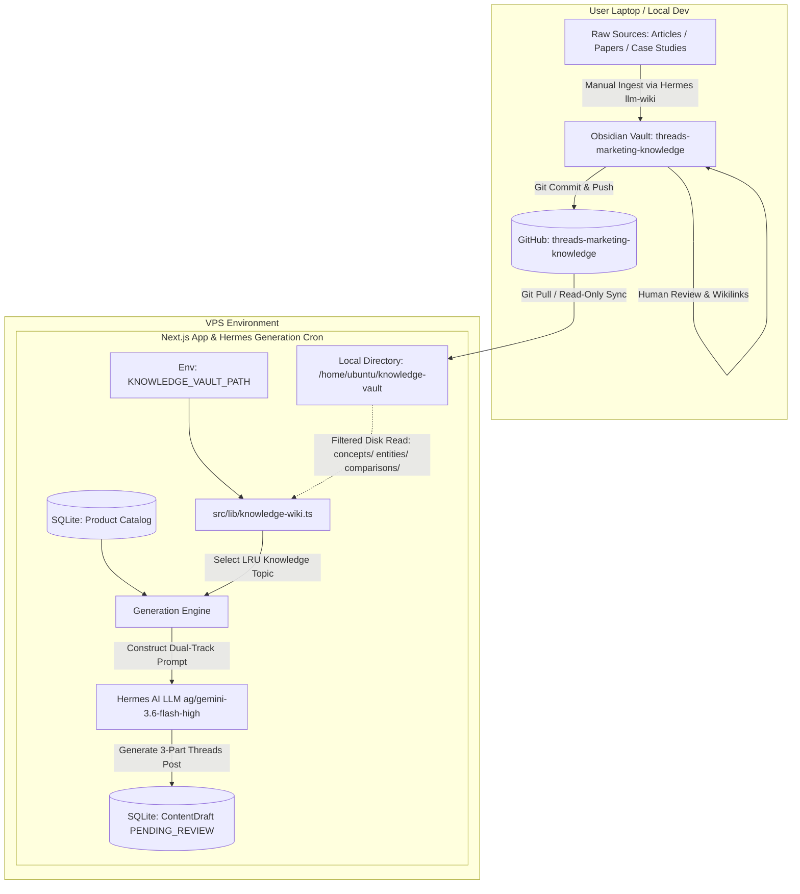

# Phase 2: Standalone Obsidian & Hermes LLM-Wiki Knowledge Vault Integration Specification

**Document ID**: `SPEC-2026-08-18-WIKI-001`  
**Revision**: `2.0.0` (Aligned with Karpathy LLM-Wiki Pattern & Multi-Repo Architecture)  
**Date**: 2026-08-19  
**Status**: APPROVED — IMPLEMENTATION READY  
**Target Platform**: Next.js 14 App Router, TypeScript, Multi-Repo Git Architecture, Obsidian Markdown Vault, Hermes Autonomous Agent (`ag/gemini-3.6-flash-high`)

---

## 1. Executive Summary & Vision

### 1.1 Motivation & Purpose
To generate high-converting, authentic, and non-generic Threads marketing content (both product promos and high-authority organic educational streams), the system integrates a dedicated **Markdown Knowledge Base (Karpathy's LLM-Wiki Pattern)** housed in a separate repository (`threads-marketing-knowledge`).

### 1.2 Separation of Concerns & Roles
* **Database (`Product` Catalog in SQLite)**: Stores official product listings, active pricing variants, USPs, target audiences, and CTA templates managed via the Web UI (`/products`).
* **Knowledge Vault (`threads-marketing-knowledge` repo)**: Stores deep research notes, hook formulas, buyer psychology triggers, tool teardowns, and industry case studies.
* **Single-Writer / Read-Only Consumer Model**:
  - **Local Workstation (User / Single Writer)**: Ingests raw articles, curates concepts, manages `[[wikilinks]]`, and validates notes using Obsidian + Hermes CLI (`llm-wiki` skill), then pushes to GitHub.
  - **Production/Dev Server (VPS / Read-Only Consumer)**: Clones the vault repository into a local path (configured via `KNOWLEDGE_VAULT_PATH`) and pulls updates. The Next.js app and Hermes generation cron read local markdown files with zero write-conflict risk.

---

## 2. Multi-Repo Architecture & Integration Flow



---

## 3. Karpathy 3-Layer Vault Structure & Frontmatter Schema

### 3.1 Vault Directory Organization
The knowledge repository follows the Karpathy LLM-Wiki standard:
```
threads-marketing-knowledge/
├── SCHEMA.md                 # Layer 3: Conventions, rules, and tag taxonomy
├── index.md                  # Layer 3: Sectioned content catalog with one-line summaries
├── log.md                    # Layer 3: Chronological action log (append-only)
├── raw/                      # Layer 1: Immutable raw source articles & papers (SKIPPED BY ENGINE)
│   ├── articles/
│   ├── papers/
│   └── transcripts/
├── entities/                 # Layer 2: Digital products, tools, platforms, & frameworks
├── concepts/                 # Layer 2: Copywriting hooks, psychology triggers, & actionable tactics
├── comparisons/              # Layer 2: Head-to-head teardowns & comparison matrices
└── queries/                  # Layer 2: Synthesized deep research answers
```

### 3.2 Dual-Compatible Frontmatter Schema (YAML)
Every note in `entities/`, `concepts/`, `comparisons/`, and `queries/` uses a standardized YAML frontmatter parsed seamlessly by Hermes `llm-wiki` and `src/lib/knowledge-wiki.ts`:

```yaml
---
id: "doubt-driven-development"
title: "Doubt-Driven Development"
created: 2026-08-19
updated: 2026-08-19
type: concept # entity | concept | comparison | query
category: "Content & Hooks" # Product Intelligence | Content & Hooks | Audience Psychology | Platform Dynamics | Industry Case Studies
tags: [frameworks, pattern-interrupt, anti-patterns, quality-assurance]
targetAudience: "Software Engineers, Tech Leads, Quality Engineers"
summary: "Pola peninjauan AI agent dengan mendispatch subagent netral yang bertugas khusus membuktikan celah/kegagalan kode."
priority: "HIGH" # HIGH | NORMAL | LOW
sources: [raw/articles/source-file.md]
sourceUrl: "https://example.com/source"
confidence: high # high | medium | low
contested: false
contradictions: []
---

# Doubt-Driven Development

## Definisi & Mekanisme Inti
...

## Kenapa Efektif di Threads ID
...

## Formula / Struktur Eksekusi
...

## Contoh Kontras (Anti-Generic Check)
- ❌ Contoh Buruk / Klise AI: ...
- ✅ Contoh Bagus / Natural: ...

## Entitas Terkait
- [[addyosmani-agent-skills]]
- [[source-driven-development]]
```

---

## 4. Component Architecture & Engine Specifications

### 4.1 `src/lib/knowledge-wiki.ts`
* **Configuration**:
  - `KNOWLEDGE_VAULT_PATH`: Configured in `.env` (defaults to `./knowledge` or sibling directory).
* **Scan & Filter Rules (`loadAllKnowledgeTopics`)**:
  - **Included Folders**: Recursively scans only `concepts/`, `entities/`, `comparisons/`, and `queries/`.
  - **Excluded Folders & Files**:
    - Ignores `raw/` completely (prevents long, unformatted source articles from bloating LLM context).
    - Ignores hidden folders (`.git`, `.obsidian`).
    - Ignores root schema/meta files (`SCHEMA.md`, `index.md`, `log.md`).
* **Parser (`parseMarkdownFrontmatter`)**:
  - Zero-dependency lightweight YAML frontmatter parser extracting `id`, `title`, `category`, `tags`, `targetAudience`, `summary`, `priority`, `sourceUrl`, and markdown body content.
* **LRU Selection (`selectLRUKnowledgeTopic`)**:
  - Compares topic `id` against `metadata.sourceTopicId` in recent `ContentDraft` records.
  - Prioritizes unvisited topics first, then least-recently used topics.

### 4.2 Dual-Track Generation in `src/lib/generation-engine.ts`
1. **Commercial Product Promo Track (`product != null`)**:
   - Ingests product details from SQLite `Product` catalog (variants, USP, target audience).
   - Injects commercial marketing angle (e.g. `unpopular_truth`, `workflow_teardown`, `cost_math_contrast`).
   - Produces high-converting promo threads with pricing and CTA referencing store username (`@hades.zshrc`).
2. **Organic Educational Track (`product == null`, `knowledgeTopic != null`)**:
   - Ingests `KnowledgeTopic` from `knowledge-wiki.ts`.
   - Injects topic summary, core insights, contrast examples, and target persona.
   - Applies organic copywriting angles (zero hard-selling, pure high-utility education + soft discussion CTA).

### 4.3 ContentDraft Persistence & Metadata
The generated organic draft is saved to SQLite with:
* `ContentDraft.productId`: `null`
* `ContentDraft.source`: `'HERMES_AI'`
* `ContentDraft.hookAngle`: `knowledgeTopic.category`
* `ContentDraft.metadata`: JSON string:
  ```json
  {
    "generatedFrom": "OBSIDIAN_KNOWLEDGE_VAULT",
    "sourceTopicId": "doubt-driven-development",
    "sourceTopicTitle": "Doubt-Driven Development",
    "sourceCategory": "Content & Hooks",
    "generatedAt": "2026-08-19T08:30:00.000Z"
  }
  ```

---

## 5. Synchronization & Deployment Protocol

### 5.1 Local Development (Mac / Workstation)
* Set in `.env`:
  ```env
  KNOWLEDGE_VAULT_PATH="/Users/tra-mac-020423/Documents/TraspacGitlab/research/threads-marketing-knowledge"
  ```
* Ingestion of raw materials and Obsidian editing happens locally.

### 5.2 Production Server (Ubuntu VPS)
1. Clone knowledge repo once:
   ```bash
   git clone git@github.com:HanifMukkorrobin/threads-marketing-knowledge.git /home/ubuntu/knowledge-vault
   ```
2. Set in production `.env`:
   ```env
   KNOWLEDGE_VAULT_PATH="/home/ubuntu/knowledge-vault"
   ```
3. Periodic pull (or deployment webhook) executes `git pull` in `/home/ubuntu/knowledge-vault` (clean read-only pull without local merge conflicts).

---

## 6. Verification & Test Plan

1. **Unit Tests (`tests/knowledge-wiki.test.ts`)**:
   - Verify that `loadAllKnowledgeTopics()` correctly scans `concepts/`, `entities/`, and `comparisons/`.
   - Verify that `raw/`, `SCHEMA.md`, `index.md`, and `log.md` are **strictly excluded**.
   - Verify frontmatter parsing with and without quotes/arrays.
   - Verify LRU rotation logic against mocked draft histories.
2. **Generation Engine Tests (`tests/generation-engine.test.ts`)**:
   - Verify dual-track generation (commercial promo vs organic wiki topic).
   - Verify draft metadata formatting and 500-char-per-post limits.
